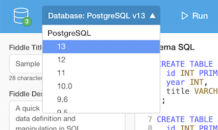

**CMSI 3520** Database Systems, Fall 2021

# Assignment 0913
To get us started, this assignment is all about just playing—“fiddling”—with a no-setup, no-hassle database system. Fortunately, there are fiddle-style websites out there that are tailored for databases. For this assignment, we’ll use https://www.db-fiddle.com.

And, for a dash of fun (and interaction with classmates), we’ll channel (or draw out) our inner YouTubers by adding an online video element to the deliverables.

## Background Reading
For conceptual coverage, Elmasri & Navathe Chapters 1–4 should provide the greatest amount of detail, depth, and background for this initial assignment.

You can derive some inspiration for potential data-centric applications by browsing the datasets available from the [Kaggle](https://www.kaggle.com/datasets) and [Awesome Public Datasets](https://github.com/awesomedata/awesome-public-datasets) collections. The only one that’s off-limits: we’ll be using the [Netflix Prize](https://www.kaggle.com/netflix-inc/netflix-prize-data) dataset as our on-going case study throughout the semester, so pick something that isn’t that one!

Refer to these “super basic” crib sheets in order to get started with SQL and database diagramming—of course there are many other sources of SQL and diagramming information on the web, and you are free to look for those if you need more. But these are intended to be good enough for now, so that you don’t feel like you’re going down a database rabbit hole 🐰:
- [Super Basic Database Diagramming](https://dondi.lmu.build/share/db/super-basic-database-diagramming.pdf)
- [Super Basic SQL](https://dondi.lmu.build/share/db/super-basic-sql.pdf)

## For Submission: Database Fiddle Tutorial
1. Envision an application that will need a simple database to get its work done. You can take inspiration from a real-world dataset if needed—see the dataset links above.
    * Stay within three (3) entities or fewer…
    * …but aim for at least one (1) relationship (a.k.a. key reference) across tables (a table can relate to itself)
2. In this assigned group repository, write up a Markdown file called _about.md_ to describe it. Don’t be shy—hype it up, give it some flavor!
3. Sketch out its design using basic entities, relationships, and attributes. Indicate key references as needed. Save the design with _schema_ as its base name in a suitable standard file format such as _.png_, _.jpg_, _.svg_, or _.pdf_.
4. Build the database collaboratively on https://www.db-fiddle.com. Include the final DB Fiddle link in your _about.md_ Markdown file.
    * Choose _PostgreSQL v13_ as your database.

      

    * Create the necessary tables and test data in the schema SQL section.
    * Insert some “play” data as well—enough to show the capabilities of your queries (see ⬇️) but not so much as to get cumbersome.
5. Implement five (5) or more database queries that your envisioned application might need.
    * Supply plain-English descriptions of those queries via comments.
    * At least two (2) queries must filter a subset of table rows.
    * At least two (2) queries must involve more than one table.
6. Record a short screenshare video (~10 minutes) showing off your baby database; (appropriate) fun factor is optional but encouraged.
    * _Every_ member of the group should have an equitable amount of _solo_ or _lead_ time in the video.
    * Walk us briefly through the structure and content of the database.
    * Provide the use cases for your queries and run them live (you may edit the query portion of the fiddle onscreen to contain just the query-of-the-moment to keep things in better focus).
7. Ultimately, you will supply these deliverables:
    * Your DB fiddle, whose link is in…
    * …your Markdown document, named _about.md_
    * Your database diagram, named _schema.`ext`_—`ext` determined by whatever the file type turns out to be
    * Your screenshare video: upload this one to Brightspace under your group’s _Database fiddle tutorial_ assignment

## How to Turn it In
What we just said ⬆️ but to summarize:
- Commit the following to this repository:
    * _about.md_ (make sure that your final PostgreSQL v13 DB Fiddle URL is in there)
    * _schema.`ext`_
- Upload your video to the _Database fiddle tutorial_ assignment in Brightspace

## Specific Point Allocations
This assignment is scored according to outcomes _1a_ to _1c_, _3c_, and _4a_ to _4f_ in the [syllabus](https://dondi.lmu.build/fall2020/cmsi486/cmsi486-fall2020-syllabus.pdf). For this particular assignment, graded categories are as follows:

| Category | Points | Outcomes |
| -------- | -----: | -------- |
| _about.md_ description | 10 points | _1a_, _1b_ |
| Database diagram | 15 points | _1b_ |
| Database fiddle schema (DDL) | 30 points | _1b_, _1c_, _3c_, _4a_ |
| Database fiddle queries (DML)—five (5) or more | 30 points | _1b_, _1c_, _3c_, _4a_ |
| • Plain English descriptions supplied as comments • At least two (2) queries filter a subset of rows • At least two (2) queries with more than one table | deduction only, if not fulfilled | |
| Tutorial video | 15 points | _1a_, _1b_ |
| Tutorial video fun factor | up to 5 extra | 😎 |
| Typos, glitches, lack of polish | deduction only, based on severity | _4b_ |
| Clarity and effectiveness of communication | deduction only, if insufficient | _4c_ |
| Version control | deduction only, if insufficient | _4e_ |
| Punctuality | deduction only, if late | _4f_ |
| **Total** | **100** |

We reinterpret outcomes _4b_ and _4c_ in this assignment to represent the clarity, polish, and effectiveness of how you document your database fiddle and its features, whether in the written description, the database diagram, or the tutorial video.
